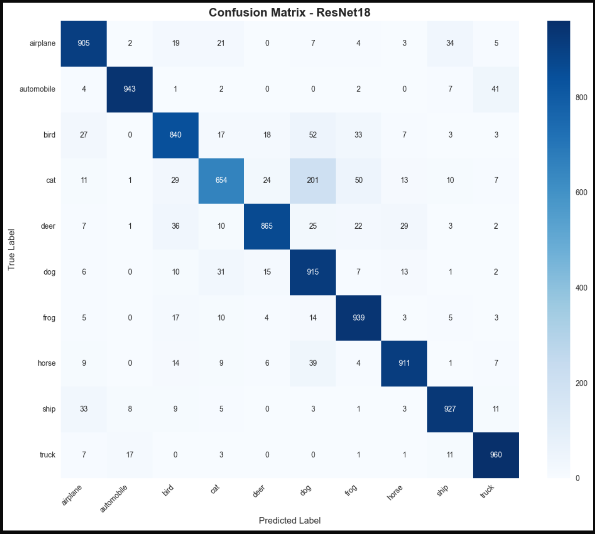

# CIFAR-10 Image Classification with ResNet18

## Project Description

This project implements a deep learning model for image classification on the CIFAR-10 dataset using ResNet18 architecture. CIFAR-10 contains 60,000 32x32 color images across 10 object categories (airplanes, automobiles, birds, cats, deer, dogs, frogs, horses, ships, and trucks).

## MEET THE TEAM!!
| Dhanush Srinivas & Ashwin Athappan| 
|------------|
| ![(team.png)| 

## Features

- **ResNet18 Implementation**: Built from scratch with residual connections to address vanishing gradient problem
- **Baseline Comparison**: Simple CNN baseline for performance comparison
- **Data Augmentation**: Random cropping and horizontal flipping for improved generalization
- **Comprehensive Evaluation**: Accuracy metrics, learning curves, confusion matrices, and misclassified examples
- **Detailed Analysis**: Side-by-side comparison of ResNet18 vs simple CNN

## Requirements

Install the required packages using:

```bash
pip install -r requirements.txt
```

### Required Libraries:
- PyTorch >= 2.0.0
- torchvision >= 0.15.0
- numpy >= 1.24.0
- matplotlib >= 3.7.0
- seaborn >= 0.12.0
- scikit-learn >= 1.3.0

## Usage

1. **Open the notebook in VS Code**:
   - Open VS Code
   - Install Jupyter extension if not already installed
   - Open `C10.ipynb`

2. **Run the notebook**:
   - Execute cells sequentially from top to bottom
   - The dataset will be automatically downloaded on first run
   - Training will take some time depending on your hardware (GPU recommended)

3. **Expected Runtime**:
   - With GPU: ~20-30 minutes for 50 epochs
   - With CPU: ~2-3 hours for 50 epochs

## Project Structure

```
Project/
├── C10.ipynb              # Main Jupyter notebook
├── requirements.txt       # Python dependencies
├── README.md             # This file
└── data/                 # CIFAR-10 dataset (auto-downloaded)
```

## Notebook Contents

1. **Setup and Imports**: Import necessary libraries and configure environment
2. **Data Loading**: Load CIFAR-10 with preprocessing and augmentation
3. **Model Architectures**: 
   - ResNet18 implementation with residual blocks
   - Simple CNN baseline for comparison
4. **Training Setup**: Configure optimizers, schedulers, and training loops
5. **Model Training**: Train both models for 50 epochs
6. **Evaluation**: 
   - Learning curves
   - Confusion matrices
   - Misclassified examples
7. **Results Comparison**: Detailed analysis of ResNet18 vs Simple CNN
8. **Conclusion**: Summary and future work suggestions

## Key Results

The notebook provides:
- Training and validation accuracy/loss curves
- Final test accuracy for both models
- Per-class accuracy breakdown
- Confusion matrices showing common misclassifications
- Visual examples of misclassified images
- Comprehensive performance comparison


## Model Architecture

### ResNet18
- 18-layer deep residual network
- Residual connections (skip connections) every 2 layers
- Batch normalization after each convolution
- ~11 million parameters


### Simple CNN (Baseline)
- 3 convolutional layers with max pooling
- 2 fully connected layers
- Dropout for regularization
- ~0.5 million parameters


## Training Configuration

- **Optimizer**: SGD with momentum (0.9)
- **Learning Rate**: 0.1 with MultiStepLR scheduler
- **Weight Decay**: 1e-4
- **Batch Size**: 128
- **Epochs**: 50
- **Loss Function**: Cross Entropy Loss

## Data Augmentation

- Random horizontal flip (p=0.5)
- Random crop (32x32 with padding=4)
- Normalization using CIFAR-10 statistics

## Future Extensions

1. Transfer learning with pre-trained weights
2. Advanced data augmentation (AutoAugment, CutMix)
3. Experiment with ResNet34, ResNet50
4. Apply to CIFAR-100 or ImageNet subsets
5. Model compression and optimization
6. Attention mechanisms (CBAM, SE blocks)

## References

- He, K., Zhang, X., Ren, S., & Sun, J. (2016). Deep residual learning for image recognition. CVPR.
- Krizhevsky, A. (2009). Learning multiple layers of features from tiny images. Technical Report.
- PyTorch Documentation: https://pytorch.org/docs/stable/index.html

## License

This project is for educational purposes.

## Author

Created as part of a machine learning project for CIFAR-10 image classification.


